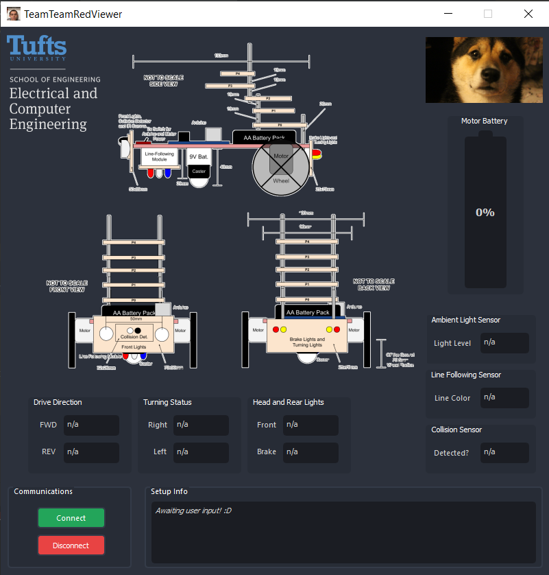

# EE31: Junior Design - Final Project, Go Beyond
This is the Go Beyond for Team Team Red for EE31.
The GUI only primarily works with Challenge 1 and if the MQTT code is uncommented.

    

The following section is an attempt at explaining how to run the GUI.

## Folder Structure
- ArduinoPIO: Folder for PlatformIO project that has basic test code for sending MQTT messages on the Arduino Uno Wi-Fi Rev2 board. main.cpp contains the basic example.
- mosquitto-mqtt-broker: Included download of mosquitto for portablility. Acts as MQTT broker (can subscribe and publish as well).
- TeamTeamRedViewer-GUI: Folder containing GUI, as a PyCharm project. GUI file of importance is TeamTeamRedViewer.py

# Setup
1. First get the MQTT broker working. This is done through mosquitto (Windows program included).
2. To run mosquitto, there are some steps involved.

(Do this first!) To find the PID of a rogue mosquitto task running on Port 1883 (will be last number):
netstat -ano | findstr ":1883"

(NOTE ADMIN POWERSHELL) The command below needs to be done in a Powershell (or cmd) with Admin perms.
To kill a specific PID (replace the whole <PID>):
taskkill /PID <PID> /F

To start the broker (Following are all Powershell commands, due to .\):
.\mosquitto -c mosquitto.conf.txt -v

To test subscribing to the broker (replace the whole <IPADDRESS>):
.\mosquitto_sub -t "arm" -h <IPADDRESS> -p 1883

To test publishing to the broker (replace the whole <IPADDRESS>):
.\mosquitto_pub -t "arm" -h <IPADDRESS> -p 1883 -m "message"

To find your local IP address, check Task Manager > Performance > Wi-Fi.

You can enter Task Manager via this shortcut: Ctrl + Shift + Esc

3. The GUI runs using PyCharm best (as in I haven't tested it elsewhere).
If you select the "TeamTeamRedViewer-GUI" folder as the PyCharm project, it should include the necessary dependencies in venv.
If not, the main dependencies are: paho-mqtt and PyQt5

4. To open the GUI, the Python file to run is "ui/TeamTeamRedViewer.py". The .ui file with the same name does not run the GUI, it is used for formatting and QtDesigner.

# Additional To-Knows
to get a new image into the PyQT GUI, you need to convert the PNG to .qrc, then qrc to .py which can be done in QTDesigner.
https://www.youtube.com/watch?v=TSAUkxDNrEo (Resource Browser on botton right, pencil icon, new resource, etc.)
After, find the .qrc, and in Powershell, goto venv/Scripts containing the PyQT-5 tools. Run .\pyrcc5 file.qrc -o outputfile.py
